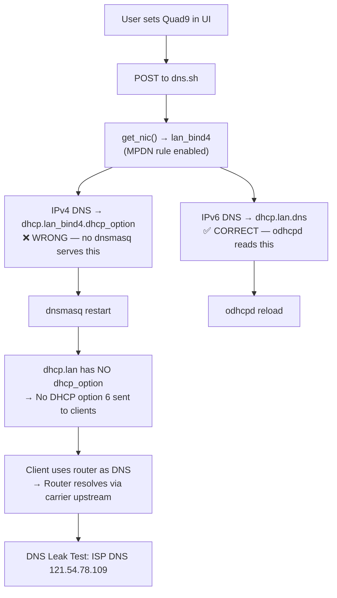

# Custom DNS Not Working — Investigation Report

**Date:** 2026-06-26
**Symptom:** User set Quad9 (9.9.9.9 / 149.112.112.112) as custom DNS, but DNS leak test shows ISP DNS (121.54.78.109 — Smart Broadband, Philippines).

---

## Summary

Custom DNS appears to save successfully in the UI (Quad9 preset selected, addresses populated, mode = enabled), but DNS leak tests reveal the ISP's resolver is still in use. The root cause is that the IPv4 DNS addresses are written to the **wrong UCI section** (`dhcp.lan_bind4` instead of `dhcp.lan`), and dnsmasq never serves them to LAN clients.

---

## Investigation Method

- Static code review of `scripts/www/cgi-bin/quecmanager/network/dns.sh`, `hooks/use-dns-settings.ts`, `components/local-network/custom-dns/custom-dns-card.tsx`, `components/local-network/custom-dns/dns-providers.ts`
- Live modem probing via Posh-SSH (read-only): UCI config, dnsmasq instances, runtime state files, qmanager logs

---

## Root Cause

### The `get_nic()` Function Returns the Wrong Target

`dns.sh` calls `get_nic()` which queries `AT+QMAP="MPDN_RULE"` to detect IP Passthrough state. When any MPDN rule has `enabled=1`, the function returns `lan_bind4` instead of `lan`.

The IPv4 DNS enable path then writes to `dhcp.$nic.dhcp_option` — i.e. `dhcp.lan_bind4.dhcp_option`:

```sh
# dns.sh lines ~137–140 (enable path)
uci set dhcp."$nic".dhcp_option="6,$dns_list"
```

But **dnsmasq only serves `dhcp.lan`**. There is no dnsmasq instance for `lan_bind4`:

```
# Only dnsmasq instance on the device:
/usr/sbin/dnsmasq -C /var/etc/dnsmasq.conf.lan_dns
```

No `/var/etc/dnsmasq.conf.lan_bind4` exists. The `dhcp.lan_bind4.dhcp_option` value is a dead letter — it is never read by any service.

### Result

- `dhcp.lan` has **no `dhcp_option`** for DNS — DHCP option 6 is never advertised to clients
- Clients fall back to using the router (192.168.224.1) as DNS
- The router's dnsmasq resolves via `/tmp/resolv.conf.d/resolv.conf.lan.auto`, which contains carrier DNS (`10.151.151.44`, `10.151.151.48`)
- ISP DNS appears in leak tests

---

## Evidence from Live Modem

### UCI state (broken)

| Section | Key | Value | Status |
|---------|-----|-------|--------|
| `dhcp.lan` | `dhcp_option` | *(missing)* | ❌ Empty — no DNS advertised |
| `dhcp.lan` | `dns` | `2620:fe::fe 2620:fe::9` | ✅ IPv6 OK (Quad9) |
| `dhcp.lan_bind4` | `dhcp_option` | `6,9.9.9.9,149.112.112.112` | ❌ Dead letter |
| `dhcp.lan_bind4` | `interface` | *(missing)* | ❌ Bare section |
| `dhcp.lan_bind4` | `instance` | *(missing)* | ❌ No dnsmasq instance |

### dnsmasq

```
$ ps | grep dnsmasq
/usr/sbin/dnsmasq -C /var/etc/dnsmasq.conf.lan_dns

$ ls /var/etc/dnsmasq.conf.*
/var/etc/dnsmasq.conf.lan_dns   ← only instance
(no lan_bind4 conf)
```

dnsmasq serves `dhcp-range=set:lan,192.168.224.100,...` — the `lan` set, not `lan_bind4`.

### Upstream resolvers (carrier)

```
$ cat /tmp/resolv.conf.d/resolv.conf.lan.auto
nameserver 10.151.151.44
nameserver 10.151.151.48
```

### qmanager log (confirms the misroute)

```
[2026-06-26 13:47:51] INFO  [cgi_dns] Enabling custom DNS on lan_bind4: dns1=9.9.9.9 dns2=149.112.112.112
[2026-06-26 13:47:56] INFO  [cgi_dns] Custom DNS enabled: IPv4=9.9.9.9,149.112.112.112 on lan_bind4
[2026-06-26 13:47:56] INFO  [cgi_dns] IPv6 DNS list applied on lan: 2620:fe::fe,2620:fe::9
```

Note: IPv6 correctly logs "on lan", IPv4 incorrectly logs "on lan_bind4".

### dns_mode file

```
$ cat /etc/qmanager/dns_mode
enabled
```

---

## Flow Diagram



---

## Why IPv6 Works (Partially)

IPv6 DNS IS correctly written to `dhcp.lan.dns` (the script hardcodes `lan` for IPv6):

```sh
# dns.sh line ~148 — correct, hardcoded lan
uci add_list dhcp.lan.dns="$_dns6"
```

odhcpd reads `dhcp.lan.dns` and advertises Quad9 IPv6 via RA RDNSS. So IPv6-capable clients that use IPv6 DNS may resolve via Quad9. But most DNS leak tests (and most browser traffic) use IPv4 DNS, which is broken.

---

## The Bug in Code

### Bug 1: IPv4 DNS Written to Wrong UCI Section (Fixed)

In `scripts/www/cgi-bin/quecmanager/network/dns.sh`, the **enable path** used the dynamic `$nic` variable for IPv4, while the **disable path** and the **IPv6 path** both hardcoded `lan`. When MPDN was active, `$nic` resolved to `lan_bind4`, and IPv4 DNS went to the wrong section.

### Bug 2: dnsmasq Upstream Not Updated (Fixed 2026-06-26)

Even after fixing Bug 1, DNS still didn't work. The script sets `dhcp_option=6` to tell clients "use Quad9," but many clients (including Windows by default) use the router as their DNS resolver regardless of DHCP option 6. The router's dnsmasq resolves through whatever upstream is configured — which was always carrier DNS (`10.151.151.44` / `10.151.151.48` from `resolv.conf.lan.auto`).

**Root cause:** The script never configured dnsmasq's own upstream servers. The `resolv-file` pointed to carrier DNS, so any client querying the router for DNS got carrier resolution, even with DHCP option 6 set to Quad9.

**Fix:** The script now sets `dhcp.lan_dns.server` (UCI list) to the custom DNS addresses. dnsmasq's `server=` directive takes precedence over `resolv-file`, so dnsmasq itself resolves through the custom DNS. On disable, the `server` entries are removed, and dnsmasq falls back to the carrier `resolv-file`.

```sh
# ENABLE path — added after DHCP option 6 block:
uci -q delete dhcp.lan_dns.server
for _ip in $dns1 $dns2 $dns3; do
    [ -n "$_ip" ] && uci add_list dhcp.lan_dns.server="$_ip"
done
for _ip6 in $dns1v6 $dns2v6; do
    [ -n "$_ip6" ] && uci add_list dhcp.lan_dns.server="$_ip6"
done

# DISABLE path — added:
uci -q delete dhcp.lan_dns.server
```

### Combined Fix Summary

| Path | Before | After |
|------|--------|-------|
| DHCP option 6 | Written to `dhcp.$nic` (wrong section) | Written to `dhcp.lan` |
| dnsmasq upstream | Carrier DNS (`resolv-file`) | Custom DNS (`server=` via UCI) |
| On disable | Only cleared DHCP option 6 | Clears DHCP option 6 + removes `server=` entries |

---

**Tier 1** — single file, single layer change.

Replace all `$nic` references in the IPv4 DNS path with hardcoded `lan`, consistent with the disable path and IPv6 path:

1. **GET handler:** Read `dhcp.lan.dhcp_option` instead of `dhcp.$nic.dhcp_option`
2. **Enable path:** Write to `dhcp.lan.dhcp_option` instead of `dhcp.$nic.dhcp_option`
3. **Enable path:** Guard with `uci show dhcp.lan` instead of `uci show dhcp.$nic`
4. **Enable path:** Delete from `dhcp.lan.dhcp_option` instead of `dhcp.$nic.dhcp_option`
5. **Log messages:** Update `$nic` → `lan` in IPv4 log lines

The `get_nic()` function and `$nic` variable can remain for logging/context purposes, but should no longer control where IPv4 DNS is written.

### Risk Assessment

- **Low risk.** The disable path already uses `dhcp.lan` and works correctly.
- **IPv6 path already uses `dhcp.lan`** without issue.
- **IP Passthrough:** Even when IPPT is active, LAN clients behind the modem should receive custom DNS from the `dhcp.lan` section. The IPPT downstream device gets carrier DNS directly and is unaffected.
- **The `dhcp.lan_bind4` section** created by the script (bare, no interface, no instance) serves no purpose and is harmless. The fix won't create new `lan_bind4` sections since we'll guard against `dhcp.lan` instead.

---

## Feature Doc Note

This issue was already documented as a **"Known Issue"** in `docs/features/custom-dns.md`:

> *"IPv4 Is Fragile When MPDN Is Active — When an MPDN rule is active, get_nic() returns lan_bind4. The IPv4 DNS is then written to dhcp.lan_bind4.dhcp_option. However, the lan_dns dnsmasq instance binds to interface='lan' — it does not automatically serve the lan_bind4 section."*

The fix described in this report resolves the documented limitation.
